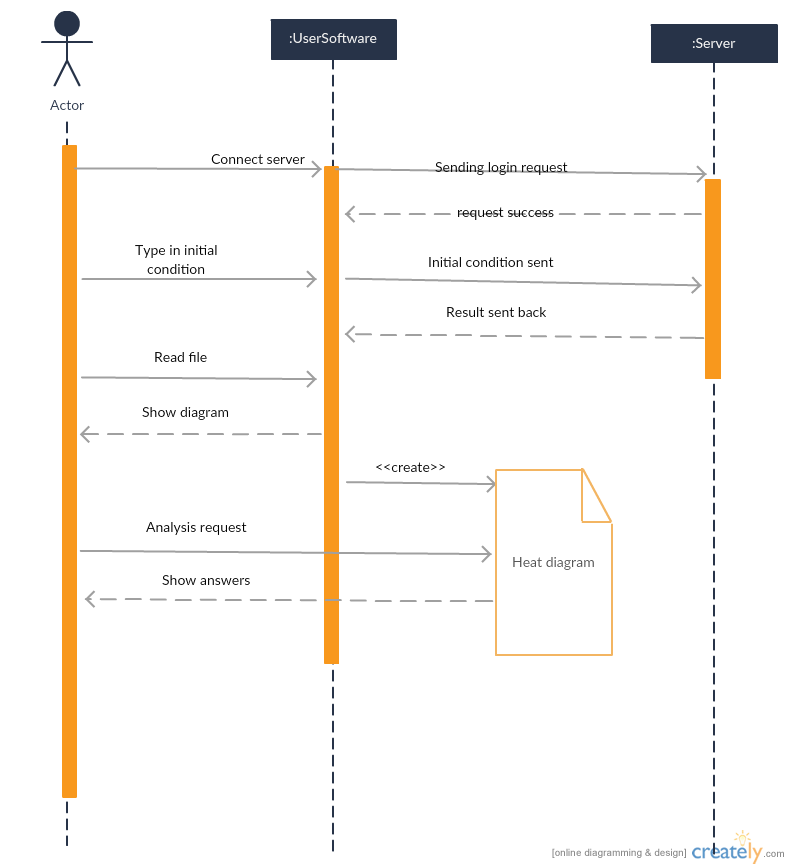
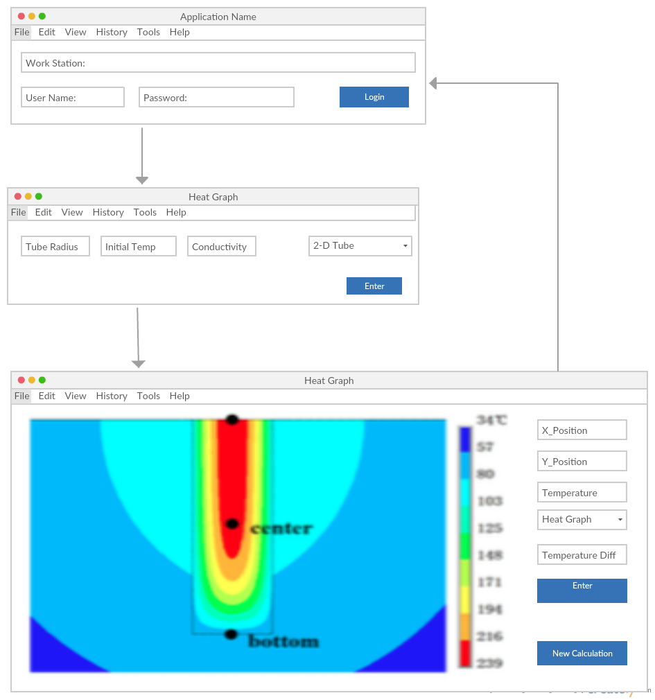

# Design Structure
Our system consists two parts: client software and server on our physics cluster.

### 1. Classes explained
#### 1.1 Server Classes
The server will have two parts:
- server function class that's actively listening for client softwares, and send back the output file;
- computation class that takes received inputs and do computation;

#### 1.2 Client Software Classes
The client software will also have two parts:
- caller class to initiate communication with the server;
- analysis class to parse output file, with analysis tools such as show temperature difference two places;

### 2. Diagrams
#### 2.1 Sequence Diagram

#### 2.2 Interface Diagram

