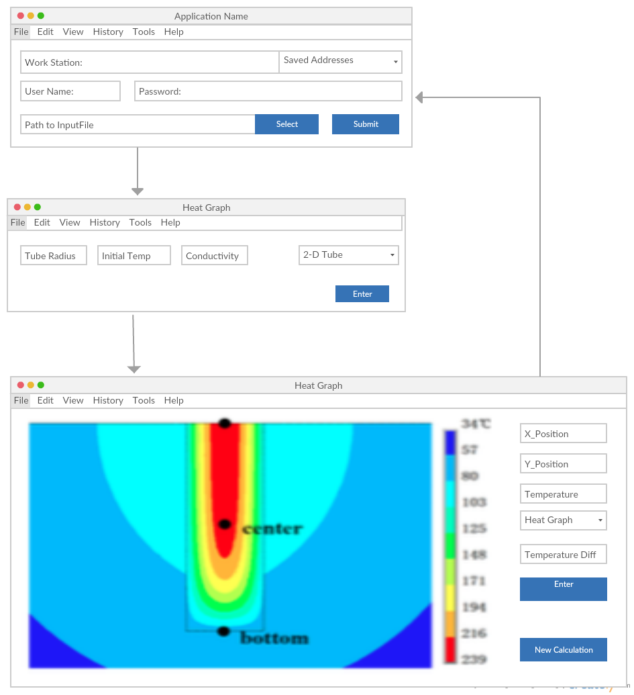

# Requirement Analysis
_Updated on 11/20 by Kuo Lu & Chris Qiao_
## 1. Introduction
### 1.1 Purpose of the system
The purpose of the system is to produce heat diffusion simulation of the
quenching in the production process of metallic glass.

### 1.2 Scope of the system
The scope of the system will be accessed by researchers around the world.

### 1.3 Objectives and Success Criteria of the Project
The server shall successfully produce a binary file that contain the simulation
result. The user software should be able to login and initiate computation.
After computation is done, the user software shall receive and read the binary
file, and do several simple analysis.

### 1.4 Definitions, acronyms, and abbreviations

### 1.5 References
1. [Bulk Metallic Glass](http://dx.doi.org/10.1063/PT.3.1885)
2. [A study of cooling process in bulk metallic glasses fabrication](http://dx.doi.org/10.1063/1.4935440)

### 1.6 Overview
A user can use client software to send initial conditions to the server.
After the server finishes computations, it sends back the data file.
The data file consists of hundreds of matrices with each one representing
temperatures at 2-D locations at a specific time.
The user can then use software to analyze data, for instance, show temperature
difference between two different points at the same time on the graph, or show
a graph of temperature vs. time at one specific position.

## 2. Current system
There is no current system.

## 3. Proposed system
### 3.1 Overview
Our system will allow the user to enter initial conditions, such as initial temperature, tube radius, heat conductivity, reservoir temperature. After complex computation, system will return a window that can play the cooling process, temperature at a particular position at a particular time, as shown below.

### 3.2 Functional requirements
The program asks the user to enter required information for simulation calculation, so it has to provide some text fields or lists to help the user input those information. After the calculation, the program produce a visualized video/image that shows temperature vs. time at each position.

### 3.3 Nonfunctional requirements
#### 3.3.1 Usability
This program is designed for physics researchers or students who are studying thermal properties of heat diffusion of quenching of metallic glass in a quartz tube. And the user should be able to give necessary information that is needed to let the program to run. The program should be simple to use, so there is no documentation needed for the user.
#### 3.3.2 Reliability
The program is designed to do simulation of heat diffusion, so it should be pretty reliable if all the data that is required to input is proper. And if there is a event of failure, restarting the system is acceptable, but that means the simulation is somehow wrong. When it is running, it produces simulation data and stores it in a file, so it should take some space in the hard drive. The system should handle improper inputs and prompt the user to give the correct inputs. There is not safety and security requirements.
#### 3.3.3 Performance
Because the simulation is associated with huge amount of calculation and data read and write, it cannot be operable while it is calculating ore reading and writing and it can take a long time. It can only handle one simulation at a time and only allow one user to use at the same time.
#### 3.3.4 Supportability
In the future it may support more shapes of quartz tubes and be able to calculate some properties of the materials. And maybe user can choose what factors are considered in the simulation, such as, conduction, radiation, dimension change of the material. Since we are open source, students and future researchers can maintains the system. We don't have a plan for porting the system on different environment, it can only run on PC.
#### 3.3.5 Implementation
Since the system can only run on PC, test and maintenance team are also needed to use PC to do their work.
#### 3.3.6 Interface
The system doesn't  interact with any existing systems. It can generate data by running simulation calculation and store it in the hard drive. And it can also read data that is created by this program.
#### 3.3.7 Packaging
Users can easily download and install the system and there is only one fast installation.
#### 3.3.8 Legal
It is going to be an open source project on Github, under GNU General Public License (GPL).

### 3.4 System models
#### 3.4.1 Scenarios
There is only one scenario: a user wants to use the program to simulate heat diffusion of a specific set up using quartz tube quenching. He enters information of the set up and start the simulation. After a while, the program finishes the calculation and allows the user to see the result of the simulation.
#### 3.4.2 Use case model
Before the program does calculation:
A user wants to enter simulation setup information and submit.
After the calculation:
- A user wants to play the video of the simulation.
- A user wants to use a mouse to pick a point to get the temperature of the point.
- A user wants to play or pause the video.
- A user wants to see the graph of temperature at a particular time he chooses.
- A user wants to store data for one simulation in the computer.
- A user wants to read data that was previously stored in the computer.

#### 3.4.3 Object model
The output result file will be in object model. It is static.
#### 3.4.4 Dynamic model
There is no dynamic model in this project.

#### 3.4.5 User interface—navigational paths and screen mock-ups

## 4. Glossary

none
